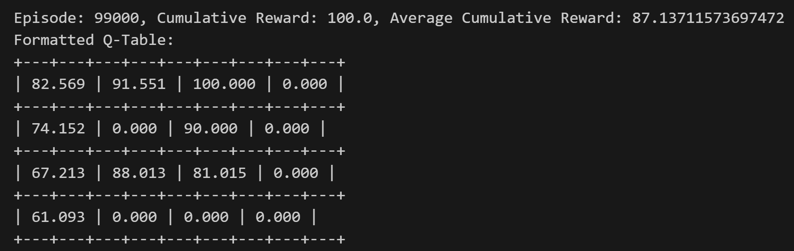

# MDP_Qlearning_RL_IceGrid
Markov Decision Process (MDP) Reinforcement Learning Agent

## Introduction
This project introduces the development and evaluation of a tabular reinforcement learning agent designed to operate within a predefined Markov Decision Process (MDP). The environment for this MDP is provided in the file `ice.py`. The primary objective of the agent is to efficiently learn an optimal policy by interacting with a stochastic and loopy environment.

## Environment Description
The environment is implemented in the `Ice` class, representing a grid-based game where the agent navigates a 4x4 grid containing various elements:
- Empty spaces (' '),
- Pits ('*'),
- Treasure ('T'),
- Goal ('G').

The agent can perform four possible actions: up, down, left, and right. However, there is a 5% probability (determined by `SLIP_PROBA`) that the agent will "slip" and remain in its initial position instead of moving as directed. This stochasticity affects the agent's decision-making process.

The rewards structure is defined as follows:
- Navigating to an empty space: No penalty or reward.
- Falling into a pit: -10 penalty.
- Finding the treasure: 20 points.
- Reaching the goal: 100 points.

The game terminates when the agent either falls into a pit or reaches the goal, making these states terminal.

## Methodology

### Initialization
The agent's learning was initialized with the following parameters:
- **Epsilon (`EPSILON`)**: Set to 0.1, controlling the trade-off between exploration and exploitation. A lower epsilon value leans towards exploiting known rewards, while a higher value encourages exploration of new actions.
- **Gamma (`GAMMA`)**: The discount factor set to 0.9, determining the importance of future rewards.
- **Learning Rate (`LEARNING_RATE`)**: Set to 0.1, this parameter adjusts how much newly acquired information overrides old information.

### Q-Table
A Q-table was initialized to maintain and update the state-action values. Each state has an array of four action values initialized to zero. This Q-table guides the agent’s decision-making process by suggesting the most rewarding actions to take in each state.

### Learning Loop
For each episode:
1. **State Initialization**: The environment is reset, and the initial state is obtained.
2. **Action Selection**: Utilizing the epsilon-greedy method, the agent either explores a random action with a probability of `EPSILON` or exploits the best-known action derived from the Q-table with a probability of `1 - EPSILON`.
3. **Environment Interaction**: The selected action is applied to the environment, resulting in a new state, a reward, and a termination flag indicating whether the episode should end.
4. **Q-Table Update**: The Q-value for the taken action is updated using the Q-learning formula:
   \[
   Q(s, a) \leftarrow Q(s, a) + \alpha \times (r + \gamma \max_{a'} Q(s', a') - Q(s, a))
   \]
   where \( s' \) is the new state, \( \alpha \) is `LEARNING_RATE`, \( \gamma \) is `GAMMA`, and \( a' \) is the action maximizing the future reward in state \( s' \).
5. **Cumulative Reward Tracking**: The cumulative reward for the episode is updated, and per-episode statistics are logged to monitor the agent’s performance over time.

### Performance Visualization
To visualize the agent's learning progress:
- **Cumulative Reward Plot**: A function `plot_rewards` was implemented to plot the cumulative reward per episode, smoothed over segments of 100 episodes to show trends more clearly.
- **Q-Table Visualization**: At intervals, the Q-table is printed in a formatted style to visually inspect the learned values.

### Conclusion of an Episode
Each episode concludes once the termination flag is set by the environment, indicating either the completion of a task within the environment or the reaching of a predefined condition, such as a maximum number of time-steps.

## Results
In this project, we developed a Q-learning reinforcement learning algorithm. The results, including the cumulative reward plot and the final values of the Q-table, demonstrate that the algorithm helps the agent efficiently reach its goal and learn an optimal policy by interacting with a stochastic and loopy environment.

This report outlines the development process and performance outcomes of the tabular reinforcement learning agent within the MDP framework, providing a comprehensive overview of the methods and results achieved during this project.

